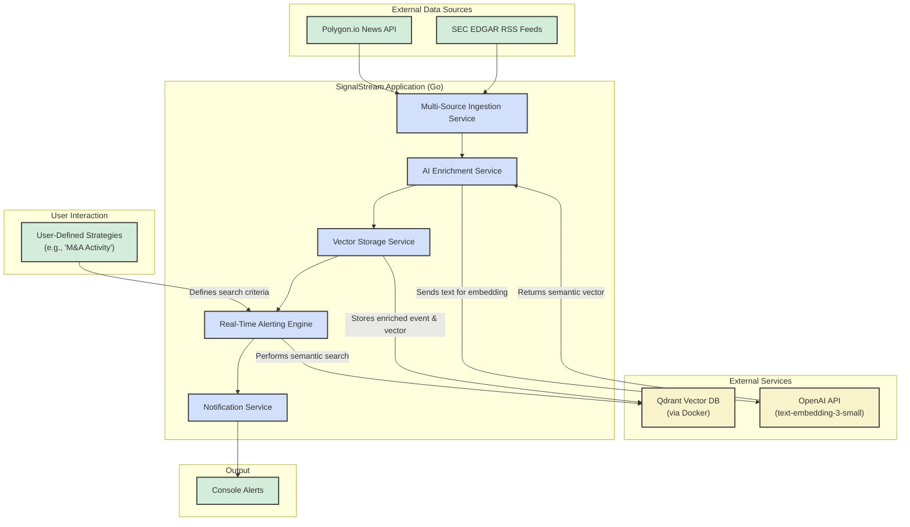

# SignalStream: AI-Powered Financial Event Analysis Platform

SignalStream is a real-time, end-to-end data engineering project that demonstrates a sophisticated pipeline for ingesting, enriching, and alerting on financial events. The platform connects to live financial news APIs and SEC filing feeds, uses AI to understand the semantic content of each event, and leverages a vector database to find and alert on events that match user-defined investment strategies.

This project showcases a high level of proficiency in Go, concurrent system design, practical AI integration, and modern data engineering principles within the finance domain.

 
## Architecture Diagram



---

## Features

*   **Multi-Source Ingestion:** Concurrently ingests data from real-time news APIs (Polygon.io) and government sources (SEC EDGAR filings).
*   **AI-Powered Enrichment:** Utilizes OpenAI's embedding models to analyze the content of each news article and filing, creating a semantic vector representation.
*   **Vector Storage & Search:** Stores enriched data in a Qdrant vector database, enabling high-speed, filtered semantic search.
*   **Real-Time Alerting Engine:** Allows users to define nuanced investment strategies (e.g., "M&A activity for portfolio companies"). It compares incoming events against these strategies and triggers alerts for relevant matches.
*   **Robust & Resilient:** Built with Go's powerful concurrency primitives, featuring graceful shutdown, rate limiting for external APIs, and a scalable worker pool architecture.

## Tech Stack & Architecture

SignalStream is built as a multi-service Go application designed for scalability and maintainability.

*   **Language:** Go
*   **Primary Libraries:**
    *   **Concurrency:** Go Routines, Channels
    *   **API Clients:** `polygon-io/client-go`, `go-openai`
    *   **Data Parsing:** `go-readability`, `gofeed`
    *   **Vector DB Client:** `qdrant/go-client`
*   **Infrastructure:**
    *   **Vector Database:** Qdrant (running via Docker)
    *   **AI Service:** OpenAI API (for `text-embedding-3-small` model)
    *   **Data Sources:** Polygon.io News API, SEC EDGAR RSS Feeds

---

## Getting Started

Follow these instructions to get a local copy up and running for development and testing purposes.

### Prerequisites

*   Go (version 1.21 or later)
*   Docker and Docker Compose
*   An active API key from [Polygon.io](https://polygon.io/) (the free plan is sufficient).
*   An active API key from [OpenAI](https://platform.openai.com/).

### Installation & Setup

1.  **Clone the repository:**
    ```sh
    git clone https://github.com/Atrix21/signalstream.git
    cd signalstream
    ```

2.  **Set up environment variables:**
    *   Copy the example environment file:
        ```sh
        cp .env.example .env
        ```
    *   Edit the `.env` file and add your secret API keys:
        ```ini
        # .env
        POLYGON_API_KEY="your_polygon_key_here"
        OPENAI_API_KEY="sk-your_openai_key_here"

        # These can usually be left as default for local setup
        LOG_LEVEL="info"
        QDRANT_ADDR="localhost:6334"
        ```

3.  **Start the Qdrant Database:**
    *   Ensure Docker Desktop is running.
    *   In the project root, run:
        ```sh
        docker-compose up -d
        ```
    *   You can verify that Qdrant is running by visiting its dashboard at [http://localhost:6333/dashboard](http://localhost:6333/dashboard).

4.  **Install Go dependencies:**
    ```sh
    go mod tidy
    ```

5.  **Run the application:**
    ```sh
    go run ./cmd/signalstream/
    ```

The application will now be running. It will create the necessary Qdrant collection on its first startup and begin ingesting and enriching data. Alerts will be printed to the console as they are triggered.

---

## Project Structure

The project follows the standard Go project layout for clarity and scalability.

```
signalstream/
├── cmd/signalstream/     # Main application entry point
├── internal/
│   ├── alerter/          # Core alerting logic and strategy definition
│   ├── config/           # Environment variable loading
│   ├── enrichment/       # AI embedding and Qdrant storage service
│   ├── ingestion/        # Data polling services (Polygon, SEC)
│   ├── notification/     # Notifier interface and implementations
│   ├── platform/         # Core data structures (NormalizedEvent)
│   └── sec/              # Utilities for SEC data (CIK mapping)
├── tools/
│   └── qdrant-inspector/ # A separate tool to inspect the Qdrant DB
├── .env.example          # Environment variable template
├── .gitignore
├── docker-compose.yml    # Docker configuration for Qdrant
├── go.mod
└── README.md
```

## Future Work

This project provides a strong foundation that can be extended in many ways:

*   **Web Interface:** Build a web UI (using Go's `net/http` or a framework like Gin) for users to create, manage, and view their strategies and alerts.
*   **Database for Strategies:** Store user strategies in a persistent database like PostgreSQL instead of hardcoding them.
*   **More Notifiers:** Implement additional `Notifier` types for services like Slack, Discord, or email (SMTP).
*   **More Data Sources:** Add more ingestion producers for sources like Twitter/X, Reddit, or alternative financial news APIs.

---

## Contact

Singireddy Aditya Reddy - aditya.singireddy.21@gmail.com

Project Link: [https://github.com/Atrix21/signalstream](https://github.com/Atrix21/signalstream)

---